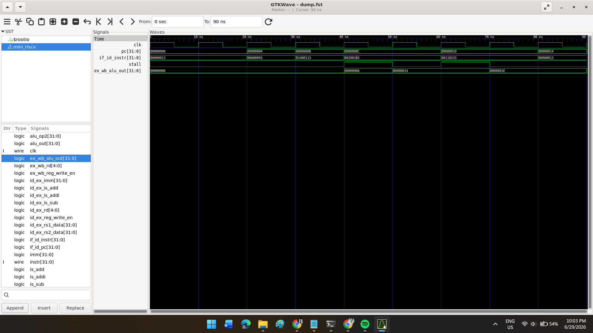

# Pipelined RV32I RISC-V Core & Hardware-Software Co-Simulation

## 📌 Overview

This repository contains a custom **4-stage pipelined RISC-V processor** implementing the **RV32I Base Integer Instruction Set**, together with a complete hardware-software co-simulation verification environment.

The RTL is simulated using **Verilator**, while a custom Python **Instruction Set Simulator (ISS)** serves as the Golden Reference Model. Verification follows the industry-standard **Step-and-Compare Co-Simulation** methodology, validating every retired instruction against the software model.

---

## 🏗️ Microarchitecture

The processor implements a classic **4-stage pipeline**:

| Stage                       | Description                                                     |
| --------------------------- | --------------------------------------------------------------- |
| **Instruction Fetch (IF)**  | Program Counter management and instruction memory access        |
| **Instruction Decode (ID)** | Instruction decoding, register file reads, and hazard detection |
| **Execute (EX)**            | ALU operations and immediate arithmetic                         |
| **Writeback (WB)**          | Register writeback and instruction retirement                   |

### Advanced Features

* Hazard Detection Unit (HDU)
* Internal Data Forwarding (Bypass Network)
* Pipeline Stall Logic
* NOP Bubble Injection
* RV32I Base Integer Instruction Support

### Hazard Detection Unit

The processor detects **Read-After-Write (RAW)** hazards and automatically:

* Stalls the Program Counter
* Freezes the Decode stage
* Injects NOP bubbles into the Execute stage

This prevents incorrect execution when operands are unavailable.

### Internal Data Forwarding

A forwarding network bypasses data directly from the Writeback stage to the Decode stage whenever a register dependency exists, eliminating unnecessary pipeline stalls caused by same-cycle read/write hazards.

---

## 🔬 Verification Strategy — Step-and-Compare Co-Simulation

Unlike simple scoreboards, processor verification requires architectural state comparison.

This project implements a complete **hardware-software co-simulation** flow.

### Golden Reference Model

A custom Python Instruction Set Simulator (`riscv_iss.py`) executes the same program independently from the RTL implementation.

### Monitor

A Cocotb monitor passively observes the Writeback stage and detects every retired instruction.

### Synchronization

Whenever the RTL retires an instruction:

1. Simulation pauses.
2. The Python ISS executes exactly one instruction.
3. All **32 architectural registers** are compared.
4. Any mismatch immediately stops the simulation.

This methodology guarantees architectural correctness throughout execution.

---

## 🐛 Development Bug Hunt (Authenticity Log)

### 1. Verilator Width Truncation

#### Problem

Verilator reported a fatal width mismatch during C++ elaboration.

The original sign-extension logic incorrectly replicated the entire instruction:

```verilog
assign imm = {{20{if_id_instr}}, if_id_instr[31:20]};
```

This produced an unintended **652-bit expression**.

#### Solution

The sign-extension logic was corrected to replicate only the instruction's sign bit.

---

### 2. Same-Cycle Read/Write RAW Hazard

#### Problem

During verification, the processor incorrectly computed:

```
10 + 0 = 10
```

instead of

```
10 + 20 = 30
```

The Step-and-Compare environment revealed that the Decode stage was reading stale register data one cycle before the Writeback stage updated the register file.

#### Solution

An internal forwarding multiplexer was added to bypass the Writeback result directly to the Decode stage whenever:

* `rs1 == ex_wb_rd`
* `rs2 == ex_wb_rd`

This eliminated the same-cycle RAW hazard.

---

## 🚀 Getting Started

### Prerequisites

Install the following tools:

* Verilator (v5.038 or newer)
* Python 3
* Cocotb

---

### Clone the Repository

```bash
git clone https://github.com/YourUsername/riscv-rv32i-cosimulation.git
cd riscv-rv32i-cosimulation
```

---

### Install Python Dependencies

```bash
pip install cocotb
```

---

### Run the Simulation

```bash
cd sim
make WAVES=1
```

---

## 📂 Repository Structure

```text
riscv-rv32i-cosimulation/
│
├── rtl/
│   └── mini_riscv.sv
│
├── tb/
│   ├── riscv_iss.py
│   └── test_mini_riscv.py
│
├── sim/
│   └── Makefile
│
├── docs/
│   ├── riscv_core_terminal_pass.png
│   └── riscv_core_waveform.png
│
└── README.md
```

---

## ✅ Verification Results

The co-simulation environment validates:

* Correct execution of RV32I instructions
* Register file integrity
* Pipeline retirement correctness
* RAW hazard detection
* Forwarding network operation
* Pipeline stall behavior
* Immediate generation
* Step-and-Compare architectural equivalence between RTL and ISS

### Terminal Output

```text
PASS: All architectural registers matched the Golden Reference Model.
Simulation completed successfully.
```


### Waveform



---

## 🎯 Learning Objectives

This project demonstrates practical implementation of:

* RISC-V RV32I Architecture
* Pipelined Processor Design
* Hazard Detection Units
* Data Forwarding Networks
* Pipeline Stall Logic
* Hardware-Software Co-Simulation
* Golden Reference Modeling
* Cocotb Verification
* Verilator Simulation
* Instruction Set Simulation (ISS)
* Architectural State Comparison
* CPU Microarchitecture Debugging

---

## 📜 License

This project is intended for educational and learning purposes.
